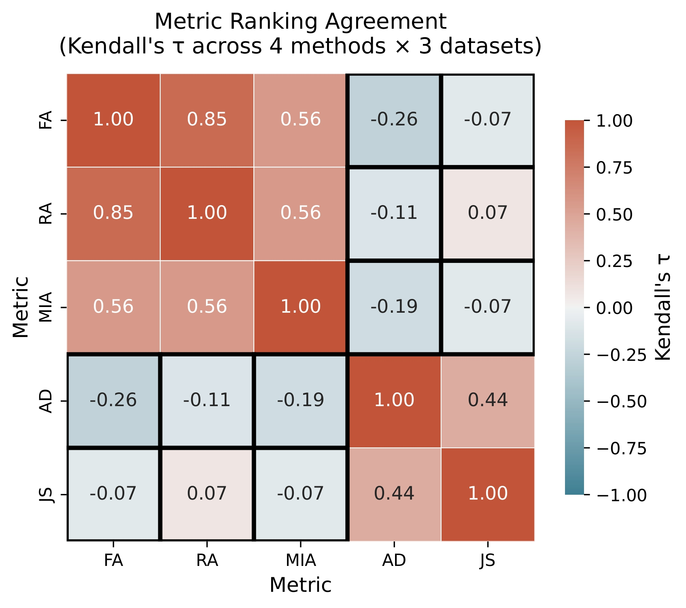
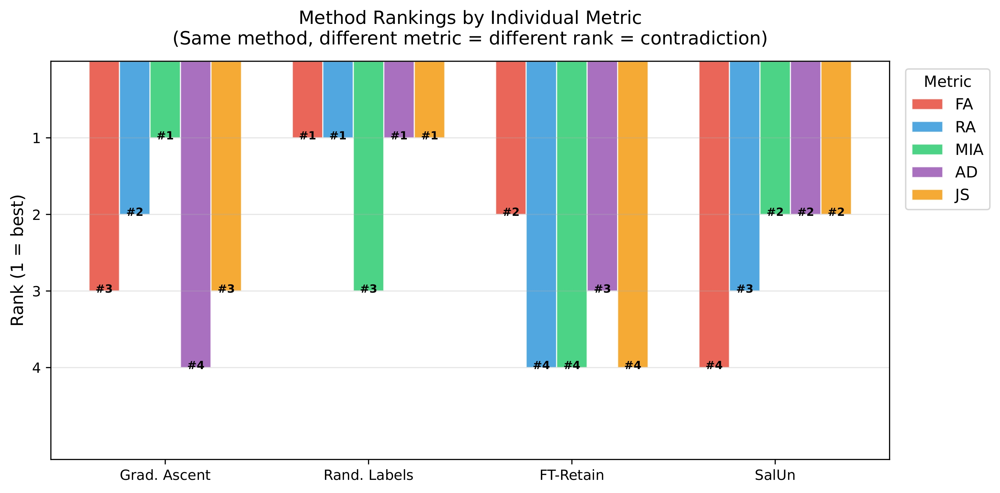
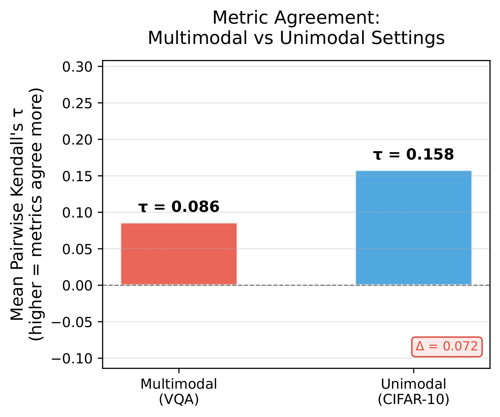
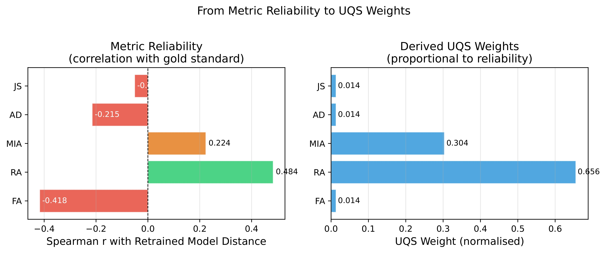
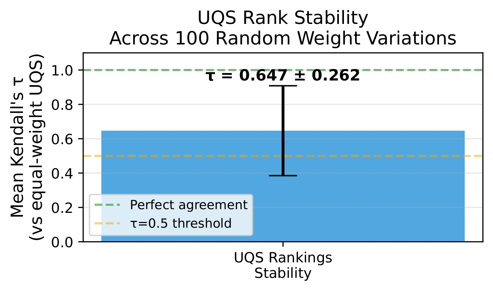
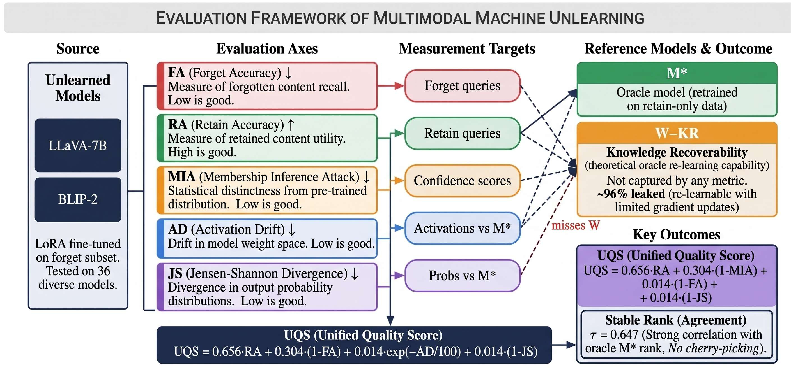

# Metric Unreliability in Multimodal Machine Unlearning

### A Systematic Analysis and Principled Unified Score

[](https://github.com/neurips26/UnifiedUnl/actions/workflows/ci.yml)
[](https://github.com/neurips26/UnifiedUnl/blob/main/LICENSE)
[](https://openreview.net/)
[](https://www.python.org/)

---

## TL;DR

Standard metrics for multimodal machine unlearning contradict each other. Output-based metrics (FA, RA, MIA) and representation-based metrics (AD, JS) capture different objectives, leading to inconsistent rankings. We introduce a Unified Quality Score (UQS) that aggregates metrics using empirically derived reliability weights.

---

## Core Insight

<p align="center">
  
</p>

Metrics form **two conflicting clusters**:

* Output behaviour: FA, RA, MIA
* Representation alignment: AD, JS

This leads to systematic contradictions:

* τ(FA, AD) ≈ −0.26

---

## Contradiction Example

<p align="center">
  
</p>

The same method is ranked differently depending on the metric.
There is **no consistent best method under individual metrics**.

---

## Multimodal Amplifies the Problem

<p align="center">
  
</p>

Metric agreement is lower in multimodal settings:

* Multimodal (VQA): τ ≈ 0.086
* Unimodal (CIFAR-10): τ ≈ 0.158

---

## Metric Reliability

<p align="center">
  
</p>

* RA is most reliable (ρ ≈ 0.484)
* FA is negatively correlated (ρ ≈ −0.418)
* AD and JS are weak standalone indicators

---

## Unified Quality Score (UQS)

<p align="center">
  
</p>

UQS combines metrics using reliability weights:

* w_RA ≈ 0.656
* w_MIA ≈ 0.304
* others ≈ 0.014

Stable rankings:

* τ ≈ 0.647 across random perturbations

---

## Missing Piece: Knowledge Recoverability

<p align="center">
  
</p>

None of the standard metrics capture whether forgotten knowledge can be recovered through indirect queries. This highlights a fundamental limitation of current evaluation.

---

## One-Command Quickstart (No GPU)

```bash
git clone https://github.com/neurips26/UnifiedUnl
cd UnifiedUnl
pip install -r requirements.txt
python benchmark/run_benchmark.py --quick
```

---

## Key Findings

| Finding | Result                                         |
| ------- | ---------------------------------------------- |
| F1      | Two metric clusters: {FA, RA, MIA} vs {AD, JS} |
| F2      | Strong contradiction (τ ≈ −0.26)               |
| F3      | Multimodal amplifies disagreement              |
| F4      | RA most reliable, FA negatively correlated     |
| UQS     | Stable ranking (τ ≈ 0.65)                      |

---

## Full Reproduction

```bash
python main.py --stage all
```

~2 days on a single RTX 4090 GPU

---

## Citation

```bibtex
@inproceedings{anonymous2026metric,
  title={Metric Unreliability in Multimodal Machine Unlearning: A Systematic Analysis and Principled Unified Score},
  booktitle={NeurIPS Datasets and Benchmarks Track},
  year={2026}
}
```

